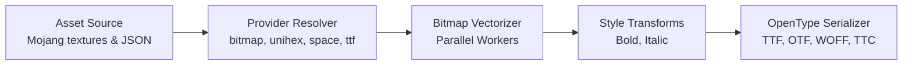

# How BlockFont Works

This document provides a technical deep-dive into **BlockFont**'s internal architecture, vectorization pipeline, OpenType table serialization, and metric normalization.

---

## Architecture Overview

BlockFont converts 8x8 bitmap textures and Unicode provider maps from Minecraft asset definitions into vector contours defined in normalized OpenType units (`unitsPerEm = 2048`).

---

## 1. Asset Resolution & Providers

Minecraft font definitions are specified in JSON files (e.g., `font/default.json`). BlockFont implements a modular provider pipeline:

- **`bitmap` Provider**: Reads PNG texture grids (e.g. `ascii.png`), extracts character width/bearing metadata, and converts non-transparent pixels into bitmap arrays.
- **`unihex` Provider**: Reads GNU Unifont `.hex` binary bitmap tables for extended CJK and Unicode coverage.
- **`space` Provider**: Contributes horizontal advance widths without visible contours (used for custom spacing and blank characters).
- **`reference` Provider**: Delegates character lookup to another font definition ID.
- **`ttf` Provider**: Extracts glyph vector contours directly from external TTF files.

---

## 2. Bitmap Vectorization

To achieve pixel-perfect rendering without subpixel anti-aliasing artifacts:

1. **Pixel Extraction**: Non-transparent pixels are mapped onto a 2D grid.
2. **Cell Merging & Contour Construction**: Adjacent pixels are merged into rectangular vector contours (`M`, `L`, `Z` commands).
3. **Coordinates Normalization**: Coordinates are converted to OpenType's $Y$-up coordinate system where:
   - Baseline $y = 0$.
   - $1 \text{ Minecraft pixel} = 128 \text{ font units}$ ($2048 / 16$).
   - Ascender $y = 1152$ (+9 pixels), Descender $y = -256$ (-2 pixels).

---

## 3. Style Variant Transformations

BlockFont generates 4 distinct typographic styles:

- **Regular**: Original un-slanted vector contours.
- **Bold**: Glyphs receive a horizontal expansion offset (+1 pixel shift overlaid via contour union, `advanceWidth` increased by 1 pixel).
- **Italic**: A geometric horizontal shear matrix is applied ($x' = x + y \times 0.25$).
  - *OpenType Metric Note*: To prevent double-slanting in TrueType rasterizers (DirectWrite, CoreText, FreeType), `italicAngle` is set to `0` and `caretSlopeRun` is set to `0`. Contours are rendered directly as-is without secondary layout slants.
- **Bold Italic**: Combines both bold expansion and italic shear.

---

## 4. OpenType Table Serialization & TrueType Collections (.ttc)

BlockFont features a native binary serializer (`src/export/ttf.ts`) that constructs standard OpenType tables and TrueType Collections:

- **`head`**: Header metrics, revision, bounding boxes.
- **`hhea` & `hmtx`**: Horizontal metrics, ascender/descender values, and side-bearings.
  - *TrueType Specification Compliance*: `hmtx.leftSideBearing` strictly matches `glyf.xMin` for every glyph to eliminate subpixel layout shifts.
- **`glyf` & `loca`**: TrueType vector contour data and offset tables.
- **`cmap`**: Format 4 (BMP) and Format 12 (full Unicode 0x10FFFF) mapping tables.
- **`os/2`**: OS/2 metrics including `sCapHeight`, `sxHeight`, `usWinAscent`, `usWinDescent`.
- **`post`**: PostScript metadata and `underlinePosition` / `underlineThickness`.
- **`name`**: Mandatory Name IDs 0–6 for full OS/PAO compatibility (including Macintosh Roman and Windows Unicode records).
- **`serializeTrueTypeCollection`**: Packages multiple subfonts into a single `.ttc` container (`BlockFont-Complete.ttc`) with 4-byte DWORD offset alignment and absolute table directory offsets.
  - *TTC Validation*: A `.ttc` collection includes all 4 font variants by default. When generating `ttc`, `styles` must be `"all"` or `["all"]`. Specific variants can be omitted using the `exclude` option (e.g. `exclude: ["italic"]`).

---

## 5. Underline Metrics

Underline metrics (`§n` in Minecraft) are defined in `minecraftUnderlineMetrics()`:
- **`underlinePosition`**: `-128` font units (-1.0 Minecraft pixel below baseline).
- **`underlineThickness`**: `128` font units (1.0 Minecraft pixel).

This places the top edge of the underline bar at $y = -128$ font units, touching descenders ('p', 'g', 'j') pixel-to-pixel and leaving an exact 1-pixel gap below baseline characters.
